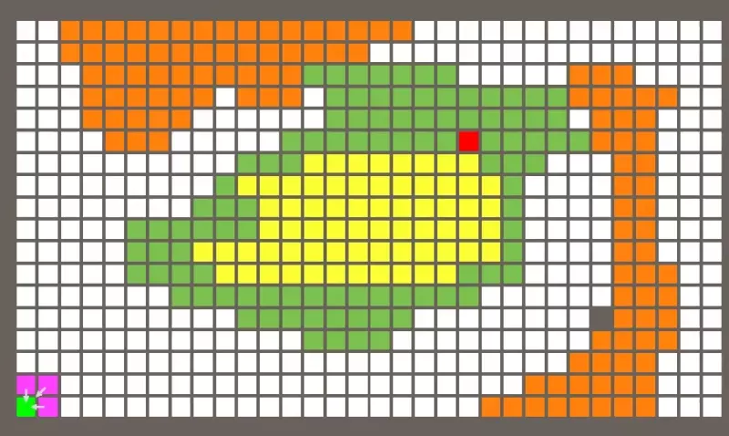
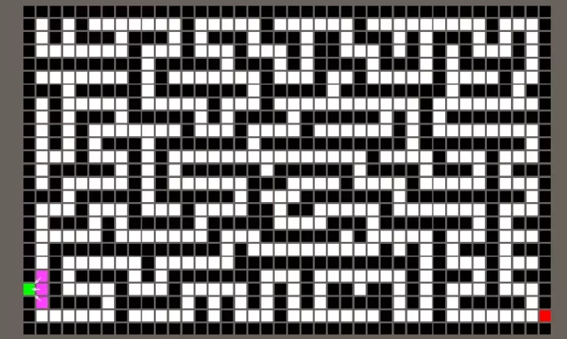

# A* pathfinding in Unity (if you have to)

Following Wilmer Lin's highly enjoyable [Pathfinding in Unity](https://www.udemy.com/course/pathfinding-in-unity/) Udemy
course on Breadth-First, Dijkstra, Greedy Best-First and A* search algorithms in Unity.

While the course code ends up a bit on the convoluted side (being somewhat sub-par
on the programming practices at times), it nicely separates map layout, 
resource loading, search and visualization concerns, while demonstrating 
the evolution of search algorithms up to A*.

